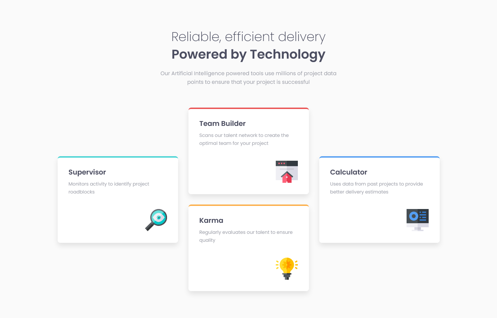
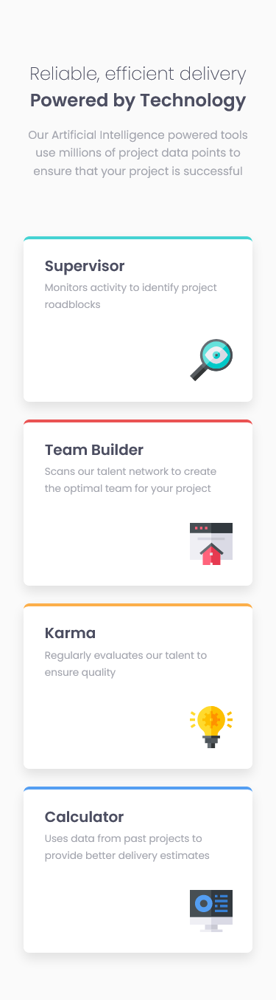

# Frontend Mentor - Four card feature section solution

This is a solution to the [Four card feature section challenge on Frontend Mentor](https://www.frontendmentor.io/challenges/four-card-feature-section-weK1eFYK). 

## table of contents

- [overview](#overview)
  - [screenshot](#screenshot)
  - [links](#links)
- [my process](#my-process)
  - [built with](#built-with)
  - [what I learned](#what-i-learned)
- [author](#author)

## overview

### screenshot

#### desktop

#### mobile

### links

- [live site url](https://daugus.github.io/fm-four-card-feature)

## my process

### built with

- Sass

## author

<!-- - Website - [daugus](https://dlcde.ml) -->

- Frontend Mentor - [@daugus](https://www.frontendmentor.io/profile/daugus)
